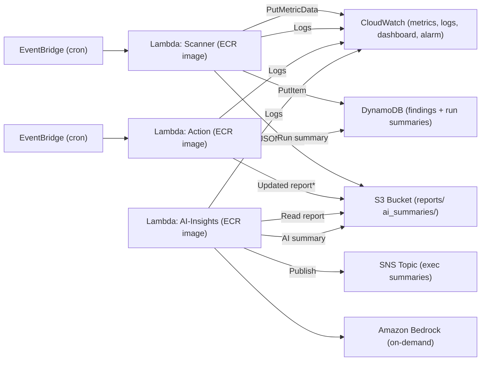

# LevelUp Retail – Serverless Cost Optimization & Monitoring (AWS)

A production‑style, **hands‑free FinOps pipeline** that finds idle resources, takes **safe automated actions**, publishes reports/metrics, and generates **AI summaries** using **Amazon Bedrock**. It runs in **staging** and **production** from **Terraform + ECR‑based Lambdas** with **GitHub Actions** CI/CD.

> This README is intentionally step‑by‑step (“idiotproof”). Copy it into your repo as `README.md`.

---

## ✨ What you’ll ship

- **Scanner Lambda** – discovers idle **EC2** and **S3**, estimates monthly savings, writes **JSON reports** to S3 and **findings** to DynamoDB, and emits **CloudWatch metrics**.
- **Action Lambda** – **tags** idle S3 buckets and **tags/stops** idle EC2 (with a **safety tag gate**). Writes a compact **run summary** to DynamoDB.
- **AI‑Insights Lambda** – reads the latest report, calls **Amazon Bedrock (on‑demand)** with a template prompt, writes an **executive summary** to S3 and **publishes to SNS**.
- **Terraform** – S3 bucket, DynamoDB table, IAM, EventBridge schedules, CloudWatch **dashboard + alarm**, SNS topic, and **ECR** repos. Lambdas are deployed from **ECR images** (not ZIPs).
- **GitHub Actions** – CI (tests + lint + Docker build + ECR push), CD (build + push + `terraform apply`).

---

## 🗺️ Architecture



<details><summary>ASCII fallback</summary>

```
EventBridge → Scanner → (writes) S3:reports/ & DynamoDB; emits CloudWatch metrics
EventBridge → Action → (tags/stops) EC2 & S3; writes DynamoDB run summary; optional updated report
AI‑Insights → reads latest S3 report → Bedrock (on‑demand) → S3:ai_summaries/ + SNS publish
CloudWatch collects logs for all Lambdas, dashboard & alarm show state and savings
```
</details>

---

## 📦 Repository layout

```
terraform/                  # IaC for all AWS resources
lambdas/
  scanner/                  # Python + Docker (ECR image)
  action/                   # Python + Docker (ECR image)
  ai_insights/              # Python + Docker (ECR image) + prompt_template.txt
.github/workflows/
  ci.yml                    # PR: tests, lint, build, push images
  cd.yml                    # main: build, push, terraform apply, roll Lambdas
```

---

## ✅ Definitions (what “idle” means)

- **EC2 idle**: average **CPUUtilization < 5%** over the **past 7 days** (hourly datapoints). Tunable via env:  
  `CPU_IDLE_THRESHOLD`, `CPU_IDLE_DAYS`.
- **S3 idle**: **empty** **or** last object older than **30 days**. Tunable via env:  
  `S3_EMPTY_DAYS`.

> These are starter defaults. Adjust to match actual cost drivers and business risk tolerance.

---

## 🔐 Safety model

- **Action Lambda** only stops EC2 instances that have tag **`AllowStop=true`** (especially important in **prod**).  
  Toggle with env var **`ENFORCE_SAFE_TAG`** (`true` by default).
- IAM policies follow **least privilege** for each Lambda’s responsibilities.
- **Bedrock** calls are **on‑demand only** (no provisioned throughput).

---

## 🧾 Data shapes (stable schemas)

### S3 report (per run)
```jsonc
{
  "run_id": "20250105T000000Z",
  "env": "staging",
  "totals": {
    "ec2": 3,
    "s3": 2,
    "overall": 5,
    "estimated_monthly_cost_savings": 17.28
  },
  "findings": [
    {
      "resource_id": "i-0123456789",
      "resource_type": "ec2",
      "env": "staging",
      "last_seen": "20250105T000000Z",
      "idle_reason": "CPU<5.0% avg 7d (1.23%)",
      "metrics_snapshot": { "cpu_avg": 1.23, "days": 7 },
      "estimated_monthly_cost_savings": 7.49,
      "risk_flags": ["missing-tags"]
    }
  ]
}
```

### DynamoDB items
- **Finding** (partitioned by env; sortable by time/type/id):
```jsonc
{
  "pk": "staging",
  "sk": "20250105T000000Z#ec2#i-0123456789",
  "gsi1pk": "run#staging",
  "gsi1sk": "20250105T000000Z",
  "payload": "{...finding json...}"
}
```
- **Run summary** by Action Lambda:
```jsonc
{
  "pk": "staging#summary",
  "sk": "20250105T003000Z",
  "gsi1pk": "run#staging",
  "gsi1sk": "20250105T003000Z",
  "payload": "{\"run_id\":\"...\",\"env\":\"staging\",\"totals\":{\"stopped\":1,\"tagged\":2,\"skipped\":3},\"actions_taken\":[ ... ]}"
}
```

---

## 🧠 AI summaries (Amazon Bedrock)

- **Prompt template** lives in `lambdas/ai_insights/prompt_template.txt`. Placeholders:  
  `{{env}}`, `{{top_n}}`, `{{top_items}}`, `{{totals}}`, `{{risks}}`.
- **Model**: set via Terraform var `bedrock_model_id` (e.g., `anthropic.claude-3-haiku-20240307-v1:0`).
- **Env vars**: `SUMMARY_TOP_N`, `SUMMARY_RECENCY_DAYS` (used to control scope and verbosity).
- **Outputs**: text summary written under `ENV/ai_summaries/<timestamp>.txt` and published to **SNS**.

> Bedrock is used with **real‑time (on‑demand) invocation only**. Do **not** enable provisioned throughput.

---

## 🧰 Prerequisites

- AWS account with permission to create IAM, ECR, Lambda, EventBridge, SNS, S3, DynamoDB, CloudWatch, and **Bedrock access** in your region.
- Docker 24+ (for building Lambda images).
- GitHub repository with Actions enabled.

---

## ⚙️ Terraform setup

1. Copy the example variables:
   ```bash
   cp terraform/terraform.tfvars.example terraform/terraform.tfvars
   ```
2. Edit `terraform/terraform.tfvars`:
   ```hcl
   project          = "levelup-retail"
   aws_region       = "us-east-1"         # pick a Bedrock-supported region
   aws_account_id   = "123456789012"
   s3_bucket_name   = "levelup-retail-costops-bucket"
   # first run uses 'bootstrap' images; CD will update tags automatically
   scanner_image_tag = "bootstrap"
   action_image_tag  = "bootstrap"
   ai_image_tag      = "bootstrap"
   ```
3. (Optional local bootstrap)
   ```bash
   cd terraform
   terraform init
   terraform plan -var-file=terraform.tfvars
   terraform apply -var-file=terraform.tfvars -auto-approve
   ```

> Terraform creates: S3 (versioned/SSE), DynamoDB (env/time schema), IAM roles/policies, EventBridge rules, SNS topic, ECR repos, **three Lambda functions from ECR images**, CloudWatch log groups, dashboard, and alarm.

---

## 🐳 Build & push Docker images

The GitHub workflows do this for you. If you want to run locally for sanity‑checks:

```bash
# Authenticate to ECR
aws ecr get-login-password --region $AWS_REGION \
| docker login --username AWS --password-stdin $AWS_ACCOUNT_ID.dkr.ecr.$AWS_REGION.amazonaws.com

# Build & push (repeat for action/ai_insights)
cd lambdas/scanner
docker build -t $AWS_ACCOUNT_ID.dkr.ecr.$AWS_REGION.amazonaws.com/levelup-costops-scanner:dev .
docker push $AWS_ACCOUNT_ID.dkr.ecr.$AWS_REGION.amazonaws.com/levelup-costops-scanner:dev
```

Update the image tags in `terraform.tfvars` to match (or let CD do that automatically on `main`).

---

## 🤖 GitHub Actions (CI/CD)

### Required repository secrets
- `AWS_ACCESS_KEY_ID`
- `AWS_SECRET_ACCESS_KEY`
- `AWS_REGION` (e.g., `us-east-1`)
- `AWS_ACCOUNT_ID`

> Prefer GitHub OIDC + a deploy role if your org supports it.

### CI (pull requests)
- Run **pytest** & **flake8**
- Build **three images** and push to ECR (tag = PR SHA)

### CD (merge to `main`)
- Build images tagged `main-<SHA>` **and** `latest`
- Rewrite image tags in `terraform.tfvars` to the new SHA
- `terraform init/plan/apply` to **staging and prod** (single state with env variables)

---

## 🔭 Monitoring & alerts

- **Metrics namespace**: `LevelUp/CostOps`
  - `IdleEC2Count` (by `Env`)
  - `EstimatedMonthlySavings` (USD approximation; tune price map in code)
- **Logs**: each Lambda has a CloudWatch Log Group (14‑day retention by default).
- **Dashboard**: `levelup-costops-dashboard` – idle counts, savings, Lambda errors/duration.
- **Alarm**: SNS notification when **IdleEC2Count > 5** in a single scan (**prod**).

---

## 🧪 Safe staging tests (before prod)

1. Launch a tiny **t3.micro** with tags `Env=staging`, `AllowStop=true`.
2. Wait for the next **Scanner** run (or trigger manually), then check:
   - `staging/reports/<timestamp>.json` in S3
   - DynamoDB: items with `pk="staging"` for findings
3. Let **Action** run (or trigger) and verify:
   - EC2 got tag `Idle=true` and **stopped**
   - `pk="staging#summary"` item exists for the run
4. Check **AI‑Insights** summary in `staging/ai_summaries/` and SNS email/Slack (depending on subscription).

> In **prod**, Action **will not stop** EC2 unless the instance is tagged `AllowStop=true` (safety gate).

---

## 💰 Cost awareness & tuning

- Savings are **rough estimates** using a small on‑demand price map (`t3.micro/small/medium`). Expand to your common instance types or fetch live pricing via the AWS Pricing API.
- Lowering thresholds increases savings but also risk. Start with conservative defaults.
- Consider adding **lifecycle policies** on S3 for **non‑prod** buckets and **EBS snapshot** pruning in future extensions.

---

## ➕ Extending the pipeline

- **RDS**: look for low CPU/IOPS, long‑idle replicas; suggest downsizing or stopping dev instances out of hours.
- **EBS**: unattached volumes older than N days; snapshot before delete; tag with `Idle=true`.
- **ECR images**: repositories with images not pulled in N days; enforce retention.
- **Auto‑tagging**: ensure resources have `Env`, `Owner`, `CostCenter`; include `risk_flags` for missing tags.
- **Business hours policy**: stop non‑prod after hours; wake on schedule or webhook.

---

## 🧩 Environment variables (Lambdas)

| Lambda | Variable | Default | Purpose |
|---|---|---:|---|
| Scanner | `CPU_IDLE_THRESHOLD` | `5` | CPU% threshold |
| Scanner | `CPU_IDLE_DAYS` | `7` | Days to average |
| Scanner | `S3_EMPTY_DAYS` | `30` | S3 inactivity window |
| Scanner | `METRIC_NS` | `LevelUp/CostOps` | Metrics namespace |
| Action | `ENFORCE_SAFE_TAG` | `true` | Require `AllowStop=true` tag |
| AI | `MODEL_ID` | `anthropic.claude-3-haiku-20240307-v1:0` | Bedrock model id |
| AI | `SUMMARY_TOP_N` | `5` | Top N offenders |
| AI | `SUMMARY_RECENCY_DAYS` | `7` | Lookback when aggregating |

All Lambdas also receive `PROJECT`, `S3_BUCKET`, `DDB_TABLE`, and for AI: `SNS_TOPIC_ARN` (wired by Terraform).

---

## 🛠 Troubleshooting

- **Bedrock access denied** → ensure the account/region has model access and Lambda role includes `bedrock:InvokeModel`.
- **Images not updating** → verify CD step rewrites tags in `terraform.tfvars` and `terraform apply` runs successfully.
- **Alarm never triggers** → confirm Scanner publishes `IdleEC2Count` and dashboard shows data in the right region.
- **Action stopped an instance you care about** → set `ENFORCE_SAFE_TAG=true` and ensure prod instances **do not** carry `AllowStop=true` unless intended.

---

## ✅ Acceptance checklist

- [ ] **Two envs**: staging & production provisioned via Terraform  
- [ ] **Lambdas from ECR images** (not ZIPs)  
- [ ] Scanner populates **DynamoDB** with findings + reasons  
- [ ] Action tags/stops per policy and writes **S3 report / DDB summary**  
- [ ] **CI** runs tests, builds images, pushes to **ECR**; **CD** applies Terraform  
- [ ] **AI‑Insights** calls Bedrock on‑demand, writes **ai_summaries/** and **SNS publish**  
- [ ] **CloudWatch dashboard** shows metrics; **SNS alarm** when >5 idle EC2 detected  
- [ ] README documents architecture, idle thresholds, staging safety, and prompt tuning

---

## 📄 License

MIT (or your choice). Add a `LICENSE` file if you need one.
